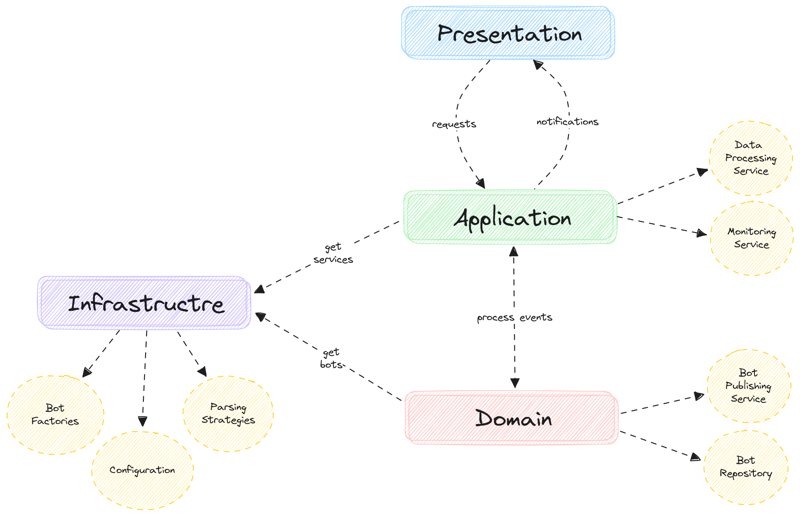

# Real-time Weather Monitoring and Reporting Service

[](https://github.com/izzat5233/realtime-weather-monitoring-system/actions/workflows/build-and-test.yml)

## **Architecture**



Explore it interactively [here](https://excalidraw.com/#json=CVKpuN2xIuhagiU4Zzap5,54ASRDZiKyOArV1QHFei5A).

## **General Task Description**

Design and implement a C# console application that simulates a real-time weather monitoring and reporting service. The system should be capable of receiving and processing raw weather data in multiple formats (JSON, XML, etc.) from various weather stations for different locations. The application should include different types of 'weather bots' each of which is configured to behave differently based on the weather updates it receives.

## **Supported Input Formats:**

### **JSON Format**

```
{
  "Location": "City Name",
  "Temperature": 23.0,
  "Humidity": 85.0
}
```

### **XML Format**

```
<WeatherData>
  <Location>City Name</Location>
  <Temperature>23.0</Temperature>
  <Humidity>85.0</Humidity>
</WeatherData>
```

The system should allow for the addition of new data formats with minimal changes to the existing code, demonstrating the Open-Closed principle of SOLID design principles.

## **Different Bot Types:**

RainBot: This bot gets activated when the humidity level exceeds a certain limit specified in its configuration. Upon activation, it performs a specific action which involves printing a pre-configured message. SunBot: This bot gets activated when the temperature rises above a certain limit specified in its configuration. Upon activation, it performs a specific action which involves printing a pre-configured message. SnowBot: This bot is activated when the temperature drops below a certain limit specified in its configuration. Upon activation, it performs a specific action which involves printing a pre-configured message.

## **Example on How to Interact with the Application:**

User starts the application, the system prompts: Enter weather data:. User enters data in JSON format: `{"Location": "City Name", "Temperature": 32, "Humidity": 40}` or XML format: `<WeatherData><Location>City Name</Location><Temperature>32</Temperature><Humidity>40</Humidity></WeatherData>`

The system responds by activating the bots according to the provided weather data and the bots' configurations. If SunBot is enabled and its temperature threshold is lower than the given temperature, the system may respond with: vbnetCopy code
SunBot activated!
SunBot: "Wow, it's a scorcher out there!"

### **Configuration Details:**

All the bot's settings should be controlled via a configuration file, including whether it is enabled, the threshold that activates it, and the message it outputs when activated. The configuration file should be in a JSON format. Here is an example:

```
{
  "RainBot": {
    "enabled": true,
    "humidityThreshold": 70,
    "message": "It looks like it's about to pour down!"
  },
  "SunBot": {
    "enabled": true,
    "temperatureThreshold": 30,
    "message": "Wow, it's a scorcher out there!"
  },
  "SnowBot": {
    "enabled": false,
    "temperatureThreshold": 0,
    "message": "Brrr, it's getting chilly!"
  }
}
```

In this example, the enabled property turns the bot on or off, the humidityThreshold or temperatureThreshold sets the limit that will activate the bot, and message is what the bot will output when it is activated. Interns need to implement functionality to read this configuration file at the start of the application, and adjust the behavior of the bots according to the given settings.

## **Additional Notes:**

The complexity of this task involves understanding and applying the Observer and Strategy design patterns, handling file input/output operations, and data manipulation for multiple formats (JSON, XML). This task simulates real-world scenarios where applications need to react to real-time data and perform different actions based on the received data and the given configuration. The application should be designed in such a way that adding new types of bots or weather data formats should not require significant changes to the existing code.
